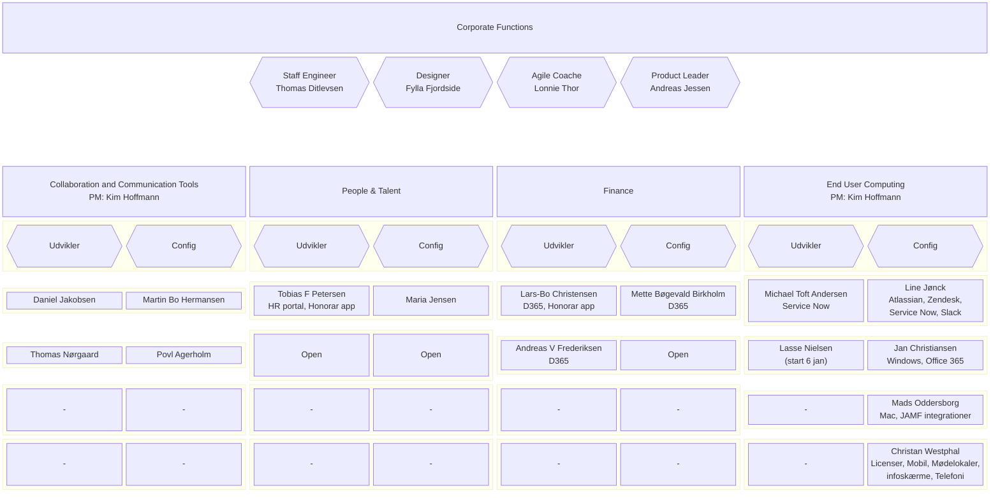

```mermaid
block-beta
    columns 8
      CorporateFunctions["Corporate Functions"]:8
      
      space:2  
      Staff{{"Staff Engineer<br>Thomas Ditlevsen"}}:1
      Designer{{"Designer<br>Fylla Fjordside"}}:1
      AC{{"Agile Coache<br>Lonnie Thor"}}:1
      PL{{"Product Leader<br>Andreas Jessen"}}:1
      
      space:2
      space:8  
           
      
      CCT["Collaboration and Communication Tools<br>PM: Kim Hoffmann"]:2
      P&T["People & Talent"]:2
      Finance:2
      EUC["End User Computing<br>PM: Kim Hoffmann"]:2
      
            
        %% -
        block:type1:2
            u1{{"Udvikler"}}
            c1{{"Config"}}
        end

        block:type2:2
            u2{{"Udvikler"}}
            c2{{"Config"}}
        end

        block:type3:2
            u3{{"Udvikler"}}
            c3{{"Config"}}
        end

        block:type4:2
            u4{{"Udvikler"}}
            c4{{"Config"}}
        end
        %% -
        block:cct1:2
            columns 2
            Developer1["Daniel Jakobsen"]
            Config1["Martin Bo Hermansen"]
        end

        block:PT1:2
            columns 2
            Developer2["Tobias F Petersen
            HR portal, Honorar app"]
            Config2["Maria Jensen"]
        end

        block:finance1:2
            columns 2
            Developer3["Lars-Bo Christensen
            D365, Honorar app"]
            Config3["Mette Bøgevald Birkholm
            D365"]
        end

        block:euc1:2
            columns 2
            Developer4["Michael Toft Andersen
            Service Now"]
            Config4["Line Jønck
            Atlassian, Zendesk,
            Service Now, Slack"]
        end
        %% -
        block:cct2:2
            columns 2
            Developer5["Thomas Nørgaard"]
            Config5["Povl Agerholm"]
        end

        block:pt2:2
            columns 2
            Developer6["Open"]
            Config6["Open"]
        end

        block:finance2:2
            columns 2
            Developer7["Andreas V Frederiksen
            D365"]
            Config7["Open"]
        end

        block:euc2:2
            columns 2
            Developer8["Lasse Nielsen 
            (start 6 jan)"]
            Config8["Jan Christiansen
            Windows, Office 365"]
        end
        %% -
        block:cct3:2
            columns 2
            Developer9["-"]
            Config9["-"]
        end

        block:pt3:2
            columns 2
            Developer10["-"]
            Config10["-"]
        end

        block:finance3:2
            columns 2
            Developer11["-"]
            Config11["-"]
        end

        block:euc3:2
            columns 2
            Developer12["-"]
            Config12["Mads Oddersborg
            Mac, JAMF integrationer
            "]
        end
        %% -
        block:cct4:2
            columns 2
            Developer13["-"]
            Config13["-"]
        end

        block:pt4:2
            columns 2
            Developer14["-"]
            Config14["-"]
        end

        block:finance4:2
            columns 2
            Developer15["-"]
            Config15["-"]
        end

        block:euc4:2
            columns 2
            Developer16["-"]
            Config16["Christan Westphal
            Licenser, Mobil, Mødelokaler,
            infoskærme, Telefoni"]
        end
        %% -
```

        
